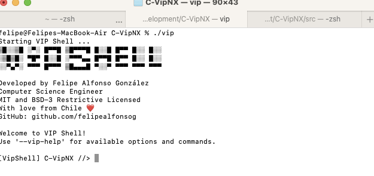

### C-VipNX (Vip Shell)* 💻 [(Experimental Project)](#important-experimental-project)* 
Shell Vip or Vip Shell is a Utility written in C for *NX Systems.
Simple: Vip shell to avoid usage of sudo.

🚀 Welcome to VIP Shell, where simplicity meets power in your command line experience. VIP Shell is a sleek and interactive command line shell designed for users who crave efficiency and elegance. With its user-friendly interface, VIP Shell empowers you to navigate and execute commands seamlessly, providing a personalized and enjoyable interaction with your Unix-like environment. Whether you're a seasoned developer or a command line enthusiast, VIP Shell is your gateway to a sophisticated and efficient command line journey. Elevate your terminal experience with VIP Shell – where every command feels like a VIP moment! 💻✨

Developed by Computer Science Engineer: **Felipe Alfonso González** - Github: [github.com/felipealfonsog](https://github.com/felipealfonsog) - Email: [f.alfonso@res-ear.ch](mailto:f.alfonso@res-ear.ch)


[](https://github.com/Naereen/badges/)

[](https://opensource.org/licenses/BSD-3-Clause)

[](https://lbesson.mit-license.org/)

[](https://www.vim.org/)
[](https://code.visualstudio.com/)

<!--
[](http://perso.crans.org/besson/LICENSE.html)
-->

<sub>* This is currently an experimental phase where the primary focus is on making the system functional and establishing a practical and logical pathway that aligns with both my vision and the project's goals. It might contain errors, bugs, etc. Many other non-core elements of the project are considered secondary.</sub>

### Table of Contents

- [Getting Started](#getting-started)
  - [Prerequisites](#prerequisites)
  - [Instructions](#instructions)
  - [File Structure](#file-structure)
- [Contributing](#contributing)
- [Creator / Maintainer](#creator--maintainer)
- [Additional Information](#additional-information)

---

### Getting Started



#### Key Features:

- Command Execution:  Execute various shell commands by entering them in the command prompt. 

- Change Directory (cd):  Change the current working directory using the cd command followed by the target directory. 

- Command History:  Keep track of the last executed commands, accessible through the --last-commands option. 

- File Tracking:  Record the paths of files related to each executed command, accessible through the --last-files option. 

- Help Option (--vip-help):  Display a help message with information about available options and commands, including exit to end the VIP Shell. 

- Sudo Privileges Check:  Request sudo privileges at the beginning of the program to ensure the execution of privileged commands. 

- Exit Command:  Allow the user to exit the VIP Shell using the exit command. 

- Clean and Readable Code:  Maintain a clean and readable code structure for easy modification and future development.


#### Installation
#### Via AUR using YAY

[](https://aur.archlinux.org/packages/vipshell)

<!-- 
[](https://aur.archlinux.org/packages/vipshell)
-->

<!-- 
https://aur.archlinux.org/packages/vipshell
-->

Term PDF Viewer is available on AUR (Arch User Repository), and it can be installed using the `yay` package manager. Follow the steps below to install Term Notes:

1. Make sure you have `yay` installed. If not, you can install it with the following command:
   
   ```
   sudo pacman -S yay
   ```
   Once yay is installed, you can install Vip shell by running the following command:
   
   ```
   yay -S vipshell
   ```
This command will automatically fetch the package from AUR and handle the installation process for you.

#### Install using a BASH script! 

[](#)


To install Vip shell, simply run the installer script available [here](https://github.com/NymexData/C-VipNX/raw/main/installer.sh).

Or just Copy - Paste in your terminal and use -curl- to start downloading the installer:

   ```
   curl -O https://raw.githubusercontent.com/NymexData/C-VipNX/master/installer.sh
   ```

If you want to use -wget- just copy/paste this line:

   ```
   wget https://raw.githubusercontent.com/NymexData/C-VipNX/master/installer.sh
   ```

   On macOS to download - wget - just install it with Homebrew:

   ```
   brew install wget
   ```

#### Important note when installing:

If you encounter issues executing the file in the terminal, like this message "-bash: ./installer.sh: Permission denied", follow these simple steps to fix it:

1. Open your terminal.
2. Navigate to the directory where the installer script is located using the `cd` command.
3. Run the following command to grant execute permission to the installer script:

   ```
   chmod +x installer.sh
   ```
   
4. Now you can run the installer without any problems.

   ```
   ./installer.sh
   ```
   NOTE: The script will ask for -sudo permissions-. Just simply type in macOS your macOS user password, and in Linux your -sudo- password.

Now type 'vipshell' in the terminal and enjoy using Vip shell! 😊🚀

Feel free to reach out if you need any further assistance!

#### Updating with the script: 
If you want to update term-notes in your system, re-run the script:

   ```
   ./installer.sh
   ```
Please note that if you encounter any issues or have suggestions, feel free to raise an issue on the [Vip shell repository](https://github.com/NymexData/C-VipNX/issues). Your feedback is invaluable!

Thank you for joining me on this journey, and I hope Vip shell brings value to your life and workflow. Let's continue making technology accessible and enjoyable for everyone!


#### 📝Important (Experimental Project)

[](#)

VIP Shell invites you to redefine your terminal experience. Whether you're a developer, enthusiast, or curious user, dive into the future of terminal interactions with VIP Shell!

<p>This project is still in its experimental stage and may have limitations in terms of features and compatibility. Use at your own discretion.</p>


### Prerequisites

#### Instructions (compilation)

You need to install tcsh in your Linux/Unix like flavor (compilation). 
 
 ```
sudo gcc -o vipshell vipshell.c
 ```

 ```
sudo vim /etc/group (nuevo grupo, ej.: staff:x:100:user
 ```

```
vim visudo
```

```
root    ALL=(ALL:ALL) ALL
vipshell     ALL=(ALL:ALL) ALL
 ```

#### File Structure

```
 |-- vip.c
 |-- vip
```


#### Contributing

Pull requests are welcome. For major changes, please open an issue first to discuss what you would like to change. Please make sure to update tests as appropriate. But i would prefer if you could contact me first. 

#### How To Contribute

1. Fork the repository to your own Github account.
2. Clone the project to your machine.
3. Create a branch locally with a succinct but descriptive name. You can use 'development' directly. 
4. Commit changes to the branch.
5. Following any formatting and testing guidelines specific to this repo.
6. Push changes to your fork.
7. Open a Pull Request in my repository - Before start a conversation.

-For Development, use the development branch and then we can do a pull request to the main branch. use : git --help for swtiching ... e.g.:

```
felipe@Felipes-MacBook-Air % git branch development
felipe@Felipes-MacBook-Air % git branch        
  development
  * main
felipe@Felipes-MacBook-Air % git checkout development
```

When git push for 'development':

```
git push --set-upstream origin development
git branch --set-upstream-to=origin development

git clone -b <branchname> <remote-repo-url>
```

---

#### Creator / Maintainer

Computer Science Engineer:
Felipe Alfonso González L. ([felipealfonsog](https://github.com/felipealfonsog))

If you have any questions, comments, or concerns, feel free to contact me by Email [f.alfonso@res-ear.ch](mailto:f.alfonso@res-ear.ch).


#### 🤝 Support and Contributions

If you find this project helpful and would like to support its development, there are several ways you can contribute:

- **Code Contributions**: If you're a developer, you can contribute by submitting pull requests with bug fixes, new features, or improvements. Feel free to fork the project and create your own branch to work on.
- **Bug Reports and Feedback**: If you encounter any issues or have suggestions for improvement, please open an issue on the project's GitHub repository. Your feedback is valuable in making the project better.
- **Documentation**: Improving the documentation is always appreciated. If you find any gaps or have suggestions to enhance the project's documentation, please let me know.

[](https://www.buymeacoffee.com/felipealfonsog)
[](https://www.paypal.me/felipealfonsog)
[](https://github.com/sponsors/felipealfonsog)

Your support and contributions are greatly appreciated! Thank you for your help in making this project better. If you need to mail me, this is the way: f.alfonso@res-ear.ch (I'm Felipe, the Computer Science Engineer behind this idea. Cheers!)

#### 📄 License

This project is licensed under the [MIT License](LICENSE).

